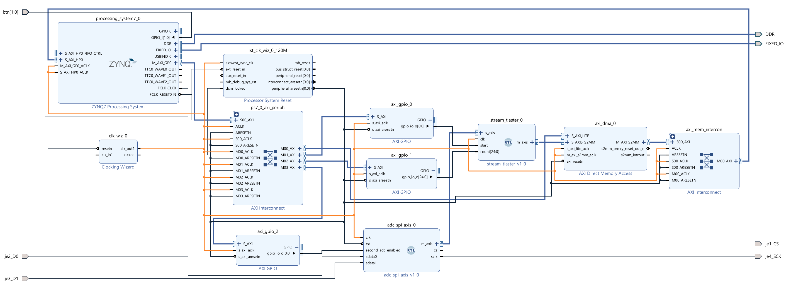
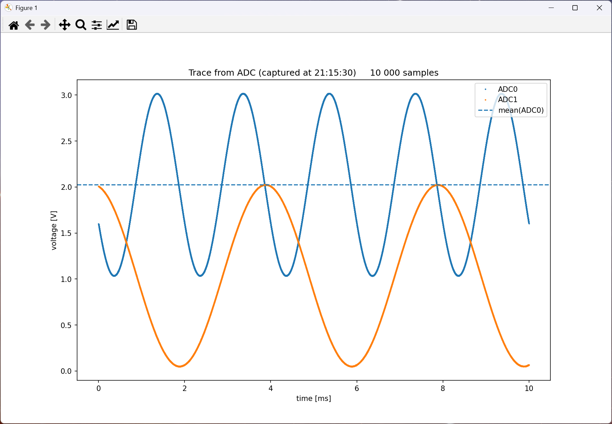

# Sample project for ADC data capture and visualisation

This folder contains a sample project that shows how a Zynq-7000 board can read data from one or two ADCs and send them in binary form to a remote PC for processing and visualisation.

I developed and tested the project on the Digilent [Zybo Z7-20](https://digilent.com/reference/programmable-logic/zybo-z7/start) board using the Digilent [Pmod AD1](https://digilent.com/reference/pmod/pmodad1/start).  
In this project, I used many of the principles I described in the HW design and the SW app of my [Zynq XADC Tutorial](https://github.com/viktor-nikolov/Zynq-XADC-DMA-lwIP). However, this time the ADC data are not produced by XADC but by the module [adc_spi_axis.v,](https://github.com/viktor-nikolov/viktorn-files-for-articles/blob/main/AD7476_breakout_board/adc_spi_axis.v) which reads them from [AD7476A](https://www.analog.com/en/products/ad7476a.html) on the Pmod AD1.

[AD7476_DMA_test_hw.xpr.zip](https://github.com/viktor-nikolov/viktorn-files-for-articles/blob/main/AD7476_breakout_board/sample_project/AD7476_DMA_test_hw.xpr.zip) is a Zybo Z7-20 HW design project exported from Vivado 2024.1.1.  
The design assumes that you connect the Digilent Pmod AD1 to the upper pins (i.e., pins 1 to 6) of the **Pmod JE** socket on the Zybo Z7.

> [!CAUTION]
>
> The voltage you apply to the analog inputs of the Digilent Pmod AD1 must be between 0 V and 3.3 V.
> 

[AD7476_DMA_vitis_export_archive.ide.zip](https://github.com/viktor-nikolov/viktorn-files-for-articles/blob/main/AD7476_breakout_board/sample_project/AD7476_DMA_vitis_export_archive.ide.zip) is a FreeRTOS application project exported from Vitis Classic 2024.1.1.  The application source files included in the archive can also be compiled in Vitis Unified 2024.

The application running on Zybo Z7 sends ADC data samples over the network to a socket server, which is the Python script [AD7476_visualiser.py](https://github.com/viktor-nikolov/viktorn-files-for-articles/blob/main/AD7476_breakout_board/sample_project/AD7476_visualiser.py).  
You must specify the IP address of the server in the constant in main.cpp. It is this line at the beginning of the main.cpp:

```c++
const std::string SERVER_ADDR( "192.168.44.10" ); // Specify your actual server IP address
```

Let me summarize. To successfully use the application, you need to perform these steps:

1. Connect Pmod AD1 to the upper pins of the Pmod JE socket on the Zybo Z7.
2. Connect a suitable signal from a signal generator to the Pmod AD1 analog input A0 or both A0 and A1 inputs. Don't forget to connect the ground.
3. Connect the network cable to the Zybo Z7 board.
4. Start the `python AD7476_visualiser.py` on your PC as the server to receive digitized data samples and show them in a chart.  
   Make sure you have Python libraries `numpy` and `matplotlib` installed before you run the script.
5. Start a serial terminal application (e.g., [PuTTY](https://www.putty.org/)) and connect it to the USB serial port of the Zybo Z7 board in your OS.
6. Specify the IP address of your server in the constant `SERVER_ADDR` at the beginning of the main.cpp.  
   If you are unsure what your PC's IP address is, use the command `ipconfig` (on Windows) or `ip a` (on Linux).
7. Build and run the application in Vitis.

After the application starts, you shall see the output in the serial terminal similar to this:

```
*************** PROGRAM STARTED ***************

------lwIP Socket Mode TCP Startup------
link speed for phy address 1: 1000
DHCP request success
Board IP:       192.168.44.120
Netmask :       255.255.255.0
Gateway :       192.168.44.1

***** AD7476 THREAD STARTED *****
will connect to the network address 192.168.44.10:65432
samples per DMA transfer: 20000

press BTN0 to start ADC conversion
press BTN1 to turn on or off the second ADC

second ADC is disabled
```

When you press the button BTN0 on Zybo Z7, data samples are read from the ADC and sent to the PC, which displays data in the chart. See a sample output of the [AD7476_visualiser.py](https://github.com/viktor-nikolov/viktorn-files-for-articles/blob/main/AD7476_breakout_board/sample_project/AD7476_visualiser.py) shown below.  
Please note that on my Windows PC, when running the script for the command line, I need to close the chart window before I can process the next set of data coming from Zybo Z7.

Pressing button BTN1 activates or deactivates the second ADC on Pmod AD1 (analog input A1).

> [!TIP]
>
> If you are using MATLAB and have a license for the Instrument Control Toolbox, you can use a MATLAB script [AD7476_visualiser_MATLAB.m](https://github.com/viktor-nikolov/viktorn-files-for-articles/blob/main/AD7476_breakout_board/sample_project/AD7476_visualiser_MATLAB.m) instead of the Python script [AD7476_visualiser.py](https://github.com/viktor-nikolov/viktorn-files-for-articles/blob/main/AD7476_breakout_board/sample_project/AD7476_visualiser.py).

&nbsp;  
**Diagram of the HW design in Vivado:**


&nbsp;  
**Sample output of the [AD7476_visualiser.py](https://github.com/viktor-nikolov/viktorn-files-for-articles/blob/main/AD7476_breakout_board/sample_project/AD7476_visualiser.py):**

